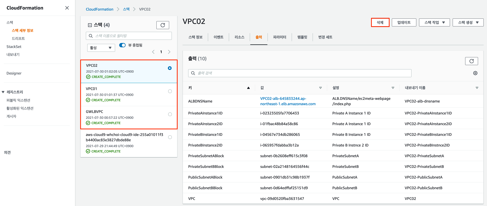

# GWLB Design 3

### 목표 구성 개요

2개의 각 워크로드 VPC (VPC01,02)은 Account내에 구성된 GWLB 기반의 보안 VPC를 통해서 내, 외부 트래픽을 처리하는 구성입니다. GWLB 기반의 보안 VPC는 2개의 AZ에 4개의 가상 Appliance가 로드밸런싱을 통해 처리 됩니다.

이러한 구성은 VPC Endpoint를 각 VPC에 분산하고, GWLB에 VPC Endpoint Service를 연결하는 분산형 구조입니다. 각 VPC01,02는 외부에 서비스를 제공하기 위해 ALB를 통해 웹 서비스를 제공하고 있으며, Private Subnet의 인스턴스는 타겟 그룹으로 연결되어 있습니다. 해당 인스턴스들을 패치 관리를 위해서 NAT Gateway를 통해 Source NAT 서비스를 받게 됩니다.

이러한 구성은 VPC Endpoint를 각 VPC에 분산하고, GWLB에 VPC Endpoint Service를 연결하는 분산형 구조이지만, 앞선 [GWLB Design1](gwlb-design1.md) 구성보다는  외부 서비스에 더 중점을 둔 디자인입니다.

#### :clapper: 아래 동영상 링크에서 구성방법을 확인 할 수 있습니다.



아래 그림은 목표 구성도 입니다.

.png>)

## Cloudformation기반 VPC 배포

### 1.VPC yaml 파일 다운로드

Cloud9 콘솔에서 아래 github로 부터 VPC yaml 파일을 다운로드 합니다. (앞선 LAB에서 다운로드 받은 경우에는 실행하지 않습니다.)

```
git clone https://github.com/whchoi98/gwlb.git

```

### 2.AWS 관리콘솔에서 VPC 배포

아래와 같이 Cloud9에서 Cloudformation을 실행합니다.

스택 세부 정보 지정에서 , **`스택이름`**과 **`VPC Parameters`**를 지정합니다. 대부분 기본값을 사용하면 됩니다.

* 스택이름 : GWLBVPC
* AvailabilityZone A : ap-northeast-2a
* AvailabilityZone B : ap-northeast-2b
* VPCCIDRBlock: 10.254.0.0/16
* PublicSubnetABlock: 10.254.11.0/24
* PublicSubnetBBlock: 10.254.12.0/24
* InstanceTyep: t3.small
* KeyPair : 미리 만들어 둔 keyPair를 사용합니다.(예.gwlbkey)

```
aws cloudformation deploy \
  --region ap-northeast-2 \
  --stack-name "GWLBVPC" \
  --template-file "/home/ec2-user/environment/gwlb/Case3/1.Case3-GWLBVPC.yml" \
  --parameter-overrides "KeyPair=$KeyName" \
  --capabilities CAPABILITY_NAMED_IAM
  
```

3\~4분 후에 GWLBVPC가 완성됩니다.

**`AWS 관리콘솔 - VPC - 가상 프라이빗 클라우드 - 엔드포인트 서비스`** 를 선택합니다. Cloudformation을 통해서 VPC Endpoint 서비스가 이미 생성되어 있습니다. 이것을 선택하고 **`세부 정보`**를 확인합니다.

VPC Endpoint Service Name을 복사해 둡니다. 뒤에서 생성할 VPC들의 Cloudformation에서 사용할 것입니다.

.png>)

VPC Endpoint Service Name을 환경변수에 저장해 둡니다.&#x20;

```
export VPCEndpointServiceName=com.amazonaws.vpce.ap-northeast-2.vpce-svc-0ff2b234e86a3e6db

```

스택 이름을 생성하고, 환경변수에 설정한 GWLBVPC의 VPC Endpoint 서비스 이름을 사용합니다 .

또한 나머지 파라미터들도 입력합니다. 대부분 기본값을 사용합니다.

* 스택이름 : VPC01, VPC02
* AvailabilityZone A : ap-northeast-2a
* AvailabilityZone B : ap-northeast-2b
* VPCCIDRBlock: 10.1.0.0/16 (VPC01), 10.2.0.0/16 (VPC02)
* GWLB SubnetABlock: 10.1.1.0/24(VPC01),10.2.1.0/24(VPC02)
* GWLB SubnetBBlock: 10.1.2.0/24 (VPC01), 10.2.2.0/24 (VPC02)
* PublicSubnetABlock: 10.1.11.0/24 (VPC01), 10.2.11.0/24 (VPC02)
* PublicSubnetBBlock: 10.1.12.0/24 (VPC01), 10.2.12.0/24 (VPC02)
* VPCEndpointServiceName : 앞서 복사해둔 GWLBVPC의 VPC endpoint service name을 입력합니다.
* PrivateToGWLB : 0.0.0.0/0 (Private Subnet이 외부로 가는 목적지에 대한 라우팅 경로 설정입니다.)
* InstanceTyep: t3.small
* KeyPair : 미리 만들어 둔 keyPair를 사용합니다. (예. gwlbkey)

```
aws cloudformation deploy \
  --region ap-northeast-2 \
  --stack-name "VPC01" \
  --template-file "/home/ec2-user/environment/gwlb/Case3/2.Case3-VPC01.yml" \
  --parameter-overrides \
    "KeyPair=$KeyName" \
    "VPCEndpointServiceName=$VPCEndpointServiceName" \
  --capabilities CAPABILITY_NAMED_IAM
  
```

```
aws cloudformation deploy \
  --region ap-northeast-2 \
  --stack-name "VPC02" \
  --template-file "/home/ec2-user/environment/gwlb/Case3/2.Case3-VPC02.yml" \
  --parameter-overrides \
    "KeyPair=$KeyName" \
    "VPCEndpointServiceName=$VPCEndpointServiceName" \
  --capabilities CAPABILITY_NAMED_IAM
  
```

아래와 같이 VPC가 모두 정상적으로 설정되었는지 확인해 봅니다.

**`AWS 관리콘솔 - VPC`**

.png>)

## GWLB 구성 확인

GWLBVPC 구성을 확인해 봅니다.

1. GWLB 구성
2. GWLB Target Group 구성
3. VPC Endpoint 와 Service 확인
4. Appliance 확인

.png>)

### 3.GWLB 구성

**`AWS 관리 콘솔 - EC2 - 로드밸런싱 - 로드밸런서`** 메뉴를 선택합니다. Gateway LoadBalancer 구성을 확인할 수 있습니다. ELB 유형이 **`"gateway"`**로 구성된 것을 확인 할 수 있습니다.

.png>)


### 4.GWLB Target Group 구성

**`AWS 관리 콘솔 - EC2 - 로드밸런싱 - 대상 그룹`**을 선택합니다. GWLB가 로드밸런싱을 하게 되는 대상그룹(Target Group)을 확인 할 수 있습니다.

* 프로토콜 : GENEVE 6081 (포트 6081의 GENGEVE 프로토콜을 사용하여 모든 IP 패킷을 수신하고 리스너 규칙에 지정된 대상 그룹에 트래픽을 전달합니다.)
* 등록된 대상 : GWLB가 로드밸런싱을 하고 있는 Target 장비를 확인합니다.

.png>)

**`AWS 관리 콘솔 - EC2 - 로드밸런싱 - 대상 그룹 - 상태검사`** 메뉴를 확인합니다.

ELB와 동일하게 대상그룹(Target Group)에 상태를 검사할 수 있습니다. 이 랩에서는 HTTP Path / 를 통해서 Health Check를 하도록 구성했습니다.

.png>)

### 5. VPC Endpoint Service 확인

Workload VPC(VPC01,02)들과 Private link로 연결하기 위해, GWLB VPC에 Endpoint Service를 구성하였습니다. 이를 확인해 봅니다.

**`AWS 관리 콘솔 - VPC - 엔드포인트 서비스`**를 선택합니다. 생성된 VPC Endpoint Service를 확인할 수 있습니다.

* 서비스 이름 - 예 com.amazonaws.vpce.ap-northeast-2.vpce-svc-03f01aa9fbb85beb4
* 유형 : GatewayLoadBalancer
* 가용영역 : ap-northeast-2a, ap-northeast-2b

2개 영역에 걸쳐서 GWLB에 대해 VPC Endpoint Service를 구성하고 있습니다.

.png>)

**`AWS 관리 콘솔 - VPC - 엔드포인트 서비스-엔드포인트 연결`**를 선택합니다.

Workload VPC (VPC01,02)의 각 가용영역들과 연결된 것을 확인 할 수 있습니다. 각 VPC별 2개의 가용영역을 구성하였기 때문에 VPC별 2개의 Endpoint가 연결됩니다. (VPC 2개를 생성해서 VPC Endpoint를 각 리전별로 구성하기 때문에 이 랩에서는 4개가 보이게 됩니다.)

.png>)

### 6. Appliance 확인

**`AWS 관리 콘솔 - EC2 - 인스턴스`** 메뉴를 선택하고, **`"appliance"`** 키워드로 필터링 해 봅니다. 4개의 리눅스 기반의 appliance가 설치되어 있습니다.

.png>)

Appliance 구성 정보를 확인해 봅니다.

**`AWS 관리콘솔 - Cloudformation - 스택`**을 선택하면, 앞서 배포했던 Cloudformation 스택들을 확인 할 수 있습니다. "GWLBVPC"를 선택합니다. 그리고 출력을 선택합니다. 값을 확인해 보면 공인 IP 주소를 확인 할 수 있습니다.

.png>)

앞서 사전 준비에서 생성한 Cloud9에서 Appliance로 직접 접속해 봅니다.

```
export Appliance3_1={Appliance1ip address}
export Appliance3_2={Appliance2ip address}
export Appliance3_3={Appliance3ip address}
export Appliance3_4={Appliance4ip address}
```

아래와 같이 구성합니다.

```
#기존 Appliance 정보를 삭제
sudo sed '/Appliance/d' ~/.bash_profile
#Appliance IP Export
export Appliance3_1=3.36.108.211
export Appliance3_2=52.79.219.13
export Appliance3_3=13.125.201.96
export Appliance3_4=15.164.176.82
#bash profile에 등록
echo "export Appliance3_1=$Appliance3_1" | tee -a ~/.bash_profile
echo "export Appliance3_2=$Appliance3_2" | tee -a ~/.bash_profile
echo "export Appliance3_3=$Appliance3_3" | tee -a ~/.bash_profile
echo "export Appliance3_4=$Appliance3_4" | tee -a ~/.bash_profile
source ~/.bash_profile
## 앞서 변경했으면 적용하지 않습니다.
mv ~/environment/gwlbkey ~/environment/gwlbkey.pem
chmod 400 ./gwlbkey.pem

```

각 Appliance에서 아래 명령을 통해 , GWLB IP와 어떻게 매핑되었는지 확인합니다. Cloud9에서 새로운 터미널 4개를 탭에서 추가해서 4개 Appliance를 모두 확인해 봅니다.

```
#Appliance 접속 
ssh -i ~/environment/gwlbkey.pem ec2-user@$Appliance1
ssh -i ~/environment/gwlbkey.pem ec2-user@$Appliance2
ssh -i ~/environment/gwlbkey.pem ec2-user@$Appliance3
ssh -i ~/environment/gwlbkey.pem ec2-user@$Appliance4

```

각 Appliance에서 아래 명령을 통해 , GWLB IP와 어떻게 매핑되었는지 확인합니다.

```
#Appliance iptablaes 확인 
sudo iptables -L -n -v -t nat

```

AZ A에 배포된 Appliance는 다음과 같이 출력됩니다.

```
[ec2-user@ip-10-254-11-101 ~]$ sudo iptables -L -n -v -t nat
Chain PREROUTING (policy ACCEPT 4987 packets, 298K bytes)
 pkts bytes target     prot opt in     out     source               destination         
  178 22464 DNAT       udp  --  eth0   *       10.254.11.60         10.254.11.101        to:10.254.11.60:6081

Chain INPUT (policy ACCEPT 4987 packets, 298K bytes)
 pkts bytes target     prot opt in     out     source               destination         

Chain OUTPUT (policy ACCEPT 1315 packets, 102K bytes)
 pkts bytes target     prot opt in     out     source               destination         

Chain POSTROUTING (policy ACCEPT 1315 packets, 102K bytes)
 pkts bytes target     prot opt in     out     source               destination         
  178 22464 MASQUERADE  udp  --  *      eth0    10.254.11.60         10.254.11.60         udp dpt:6081
```

GENEVE 터널링의 GWLB IP주소는 10.254.11.60 이며, Appliance IP와 터널링 된 것을 확인 할 수 있습니다.

AZ B에 배포된 Appliance는 다음과 같이 출력됩니다.

```
[ec2-user@ip-10-254-12-101 ~]$ sudo iptables -L -n -v -t nat
Chain PREROUTING (policy ACCEPT 5313 packets, 316K bytes)
 pkts bytes target     prot opt in     out     source               destination         
  192 23456 DNAT       udp  --  eth0   *       10.254.12.149        10.254.12.101        to:10.254.12.149:6081

Chain INPUT (policy ACCEPT 5313 packets, 316K bytes)
 pkts bytes target     prot opt in     out     source               destination         

Chain OUTPUT (policy ACCEPT 1626 packets, 123K bytes)
 pkts bytes target     prot opt in     out     source               destination         

Chain POSTROUTING (policy ACCEPT 1626 packets, 123K bytes)
 pkts bytes target     prot opt in     out     source               destination         
  192 23456 MASQUERADE  udp  --  *      eth0    10.254.12.149        10.254.12.149        udp dpt:6081
```

GENEVE 터널링의 GWLB IP주소는 10.254.12.101 이며, Appliance IP와 터널링 된 것을 확인 할 수 있습니다.

이렇게 GWLB 에서 생성된 IP주소와 각 Appliance의 IP간에 UDP 6081 포트로 터널링되어 , 외부의 IP 주소와 내부의 IP 주소를 그대로 유지할 수 있습니다. 또한 터널링으로 인입시 5Tuple (출발지 IP, Port, 목적지 IP, Port, 프로토콜)의 정보를 TLV로 Encapsulation하여 분산처리할 때 사용합니다.

## Workload VPC 확인

이제 각 VPC에서 실제 구성과 트래픽을 확인해 봅니다.

1. VPC Endpoint 확인
2. GWLB Subnet Route Table 확인
3. Public Subnet Route Table 확인
4. ALB 확인
5. Private Subnet Route Table 확인
6. Ingress Routing Table 확인

.png>)

1. 외부 트래픽은 인터넷 게이트웨이로 접근
2. Ingress Route Table에 의해 GWLB Endpoint로 트래픽 처리
3. GWLB Subnet의 VPC Endpoint는 GWLB VPC Endpoint Service로 전달
4. GWLB로 트래픽 전달
5. AZ A,AZ B Target Group으로 LB 처리 - UDP 6081 GENEVE로 Encapsulation (TLV Header - 5Tuple)
6. Appliance으로 트래픽 인입
7. Appliance에서 트래픽 반환
8. GWLB로 트래픽 반환
9. Decap 해서 다시 VPC Endpoint Service로 전달
10. GWLB Subnet VPC Endpoint로 전달
11. Public Subnet ALB로 전달
12. ALB (Internet Facing) 은 Private Target Group에 포함된 인스턴스로 전달. (Private EC2 인스턴스)
13. Return되는 트래픽은 ALB를 거쳐서, GWLB EP-GWLB-Internet Gateway로 다시 전달


VPC01,02 NAT Gateway는 Private EC2 인스턴스들의 PAT로 동작하며, Private EC2 인스턴스들이 내부에서 외부로 Initiate 되는 트래픽들을 처리합니다. (Patch, 패키지 다운드로 등...)


.png>)

### 7. Ingress Route Table 확인

**`AWS 관리콘솔 - VPC - 라우팅 테이블`**을 선택하고 VPC01,02-IGW-Ingress-RT 이름의 라우팅 테이블을 확인해 봅니다. Ingress Routing Table에 대한 구성을 확인 할 수 있습니다. GWLB Subnet,Public Subnet으로 인입 되는 트래픽을 특정 경로로 보내는 역할을 합니다. 여기에서는 GWLB VPC Endpoint로 구성하도록 되어 있습니다.

.png>)


Ingress Routing에서 Private Subnet에 대한 라우팅 설정은 왜 없을까요?

외부에서 Ingress Routing 접근은 Internet Gateway에서 공인 IP로 설정된 트래픽만 설정할 수 있습니다. 이 랩에서는 외부에서 ALB로 접근할 것입니다. ALB는 Public Subnet에 할당 되어 있고, 공인 IP를 받을 수 있도록 설정되어 있습니다. Private Subnet에 대한 라우팅 설정은 Ingress Routing에서 설정해도 동작하지 않습니다.


### 7.VPC Endpoint 확인

**`AWS 관리 콘솔 - VPC - Endpoint`**를 선택하여 실제 구성된 VPC Endpoint를 확인해 봅니다. 2개의 VPC에 2개씩 구성된 AZ를 위해 총 4개의 Endpoint가 구성되어 있습니다. (VPC Endpoint는 AZ Subnet당 연결됩니다.)

.png>)

####

### 8. GWLB Subnet Route Table 확인

**`AWS 관리콘솔 - VPC - 라우팅 테이블`**을 선택하고 VPC01,02-GWLBe-A,B-RT 이름의 라우팅 테이블을 확인해 봅니다. Egress(외부로 향하는 트래픽) 트래픽은 모두 IGW(Internet Gateway)로 향하도록 구성되어 있습니다.

.png>)

### 9. Public Subnet Route Table 확인

**`AWS 관리콘솔 - VPC - 라우팅 테이블`**을 선택하고 VPC01,02-Public-A,B-RT 이름의 라우팅 테이블을 확인해 봅니다. Egress(외부로 향하는 트래픽) 트래픽은 모두 GWLB VPC Endpoint로 향하도록 구성되어 있습니다.

.png>)

### 10. ALB 확인

**`AWS 관리콘솔 - EC2 - 로드밸런싱 - 로드밸런서`** 를 선택하고,  VPC01,02-alb를 선택합니다. ALB의 외부 노출되어 있는 DNS A 레코드를 확인하고, 복사해 둡니다.

.png>)

**`AWS 관리콘솔 - EC2 - 로드밸런싱- 대상그룹`** 를 선택하고,  VPC01,02-ALB-tg 를 선택합니다. 하단의 세부 정보를 확인하면 Private Subnet에 속한 4개의 인스턴스가 정상적으로 Target Group에 선택된 것을 확인 할 수 있습니다.

.png>)

**`AWS 관리콘솔 - EC2 - 로드밸런싱- 대상그룹`** 를 선택하고,  VPC01,02-ALB-tg 를 선택합니다. 하단에서 상태검사를 선택합니다. Private Subnet에 속한 4개의 인스턴스의 **`"/ec2meta-webpage/index.php"`** 로 상태검사를 하고 있는 것을 확인 할 수 있습니다. 이 랩에서는 이후에 해당 URL로 외부에서 접속해서 로드밸런싱이 제대로 되는지 확인할 것입니다.

.png>)

### 11. Private Subnet Route Table 확인

**`AWS 관리콘솔 - VPC - 라우팅 테이블`**을 선택하고 VPC01,02-Private-A,B-RT 이름의 라우팅 테이블을 확인해 봅니다. Egress(외부로 향하는 트래픽) 트래픽은 모두 NAT Gateway로 향하도록 구성되어 있습니다.

.png>)

## 트래픽 확인

### 12. Workload VPC의 EC2에서 트래픽 확인

VPC 01,02의 EC2에서 외부로 정상적으로 트래픽이 처리되는 지 확인 해 봅니다.

Cloud9 터미널을 다시 접속해서 , VPC 01,02의 Private Subnet 에 배치된 EC2 인스턴스에 접속해 봅니다. Private Subnet은 직접 연결이 불가능하기 때문에 Session Manager를 통해 접속합니다.

VPC01,02 을 Cloudformation을 통해 배포할 때 해당 인스턴스들에 Session Manager 접속을 위한 Role과 Session Manager 연결을 위한 Endpoint가 이미 구성되어 있습니다.

아래 그림에서 처럼 확인해 볼 수 있습니다.

.png>)

.png>)

먼저 Cloud9 터미널에 Session Manager 기반 접속을 위해 아래와 같이 설치합니다. (앞서 랩에서 수행했다면, 생략합니다.)

```
#session manager plugin 설치
curl "https://s3.amazonaws.com/session-manager-downloads/plugin/latest/linux_64bit/session-manager-plugin.rpm" -o "session-manager-plugin.rpm"
sudo yum install -y session-manager-plugin.rpm
git clone https://github.com/whchoi98/useful-shell.git

```

session manager 기반으로 접속하기 위해, 아래 명령을 실행하여 ec2 인스턴스의 id값을 확인합니다.

```
cd ~/environment/useful-shell/
./aws_ec2_ext.sh

```

아래와 같이 결과를 확인 할 수 있습니다.

```
whchoi:~/environment/useful-shell (master) $ ./aws_ec2_ext.sh 
--------------------------------------------------------------------------------------------------------------------------------------------------------------------------------------------
|                                                                                     DescribeInstances                                                                                    |
+-----------------------------------------------------------+------------------+----------------------+------------+------------------------+----------+----------------+------------------+
|  GWLBVPC-Appliance-10.254.12.101                          |  ap-northeast-2b |  i-065852170f36be268 |  t3.small  |  ami-07464b2b9929898f8 |  running |  10.254.12.101 |  3.35.5.188      |
|  GWLBVPC-Appliance-10.254.12.102                          |  ap-northeast-2b |  i-0cd6b81597257e7a0 |  t3.small  |  ami-07464b2b9929898f8 |  running |  10.254.12.102 |  3.34.28.238     |
|  VPC02-Private-B-10.2.22.102                              |  ap-northeast-2b |  i-022bfff134299b305 |  t3.small  |  ami-07464b2b9929898f8 |  running |  10.2.22.102   |  13.125.203.174  |
|  VPC01-Private-B-10.1.22.101                              |  ap-northeast-2b |  i-09ba281fa2130726a |  t3.small  |  ami-07464b2b9929898f8 |  running |  10.1.22.101   |  13.209.2.88     |
|  VPC03-Private-B-10.3.22.101                              |  ap-northeast-2b |  i-0c3c92c6fc8c9c691 |  t3.small  |  ami-07464b2b9929898f8 |  running |  10.3.22.101   |  52.78.149.110   |
|  VPC03-Private-B-10.3.22.102                              |  ap-northeast-2b |  i-01d50385674c2884b |  t3.small  |  ami-07464b2b9929898f8 |  running |  10.3.22.102   |  13.125.240.3    |
|  VPC01-Private-B-10.1.22.102                              |  ap-northeast-2b |  i-05e27a3db037bc1bd |  t3.small  |  ami-07464b2b9929898f8 |  running |  10.1.22.102   |  3.35.225.49     |
|  VPC02-Private-B-10.2.22.101                              |  ap-northeast-2b |  i-0548e17996fd96d57 |  t3.small  |  ami-07464b2b9929898f8 |  running |  10.2.22.101   |  13.125.91.69    |
|  GWLBVPC-Appliance-10.254.11.102                          |  ap-northeast-2a |  i-08d1d4dda9d43e487 |  t3.small  |  ami-07464b2b9929898f8 |  running |  10.254.11.102 |  3.35.53.210     |
|  GWLBVPC-Appliance-10.254.11.101                          |  ap-northeast-2a |  i-0ba703c865a94fd04 |  t3.small  |  ami-07464b2b9929898f8 |  running |  10.254.11.101 |  3.35.55.51      |
|  VPC01-Private-A-10.1.21.102                              |  ap-northeast-2a |  i-085558b0d0c93b570 |  t3.small  |  ami-07464b2b9929898f8 |  running |  10.1.21.102   |  13.125.15.119   |
|  VPC03-Private-A-10.3.21.101                              |  ap-northeast-2a |  i-0f6869867c9c1f1ff |  t3.small  |  ami-07464b2b9929898f8 |  running |  10.3.21.101   |  3.36.58.217     |
|  VPC03-Private-A-10.3.21.102                              |  ap-northeast-2a |  i-0c3cfe2fc1ad3a0eb |  t3.small  |  ami-07464b2b9929898f8 |  running |  10.3.21.102   |  13.125.97.211   |
|  VPC01-Private-A-10.1.21.101                              |  ap-northeast-2a |  i-0b41f548586fc53c0 |  t3.small  |  ami-07464b2b9929898f8 |  running |  10.1.21.101   |  52.79.199.91    |
|  VPC02-Private-A-10.2.21.101                              |  ap-northeast-2a |  i-02a6ec623eb3ac8e5 |  t3.small  |  ami-07464b2b9929898f8 |  running |  10.2.21.101   |  3.35.19.145     |
|  VPC02-Private-A-10.2.21.102                              |  ap-northeast-2a |  i-0f9c43ca89cff209d |  t3.small  |  ami-07464b2b9929898f8 |  running |  10.2.21.102   |  15.165.74.201   |
|  aws-cloud9-gwlb-console-aec439cc7860438d93a04af41e4f2364 |  ap-northeast-2d |  i-029d2fd2d6485b1d7 |  m5.xlarge |  ami-011f8bfe22440499a |  running |  172.31.63.114 |  3.36.43.51      |
+-----------------------------------------------------------+------------------+----------------------+------------+------------------------+----------+----------------+------------------+
```

session manager 명령을 통해 해당 인스턴스에 연결해 봅니다. (VPC01-Private-A-10.1.21.101)

```
aws ssm start-session --target {VPC01-Private-A-10.1.21.101 Instance ID}

```

터미널에 접속한 후에 , 아래 명령을 통해 bash로 접근해서 외부로 트래픽을 전송해 봅니다.

```
sudo -s
ping www.aws.com

```

아래와 같은 결과를 확인할 수 있습니다.

```
whchoi:~/environment/useful-shell (master) $ aws ssm start-session --target i-0b41f548586fc53c0

Starting session with SessionId: whchoi-01dc306dd4b046251
sh-4.2$ sudo -s
[root@ip-10-1-21-101 bin]# ping www.aws.com
PING aws.com (54.230.62.60) 56(84) bytes of data.
64 bytes from server-54-230-62-60.icn54.r.cloudfront.net (54.230.62.60): icmp_seq=1 ttl=240 time=2.51 ms
64 bytes from server-54-230-62-60.icn54.r.cloudfront.net (54.230.62.60): icmp_seq=2 ttl=240 time=2.08 ms
64 bytes from server-54-230-62-60.icn54.r.cloudfront.net (54.230.62.60): icmp_seq=3 ttl=240 time=2.08 ms
```

### 13. Appliance에서 ICMP 확인

앞서 Session manager를 통해 [www.aws.com으로](http://www.aws.xn--com-ky7m580d/) ping을 실행했습니다. 해당 터미널을 실행한 상태에서 Cloud9 터미널을 2개로 추가로 열어 봅니다.

아래와 같이 2개의 Appliance에 SSH로 연결해서 명령을 실행해 보고, Appliance로 Traffic이 들어오는지 확인해 봅니다.

Cloud9 터미널 1

```
ssh -i ~/environment/JAN-2021-whchoi.pem ec2-user@$Appliance1
sudo tcpdump -nvv 'port 6081'
sudo tcpdump -nvv 'port 6081'| grep 'ICMP'

```

Cloud9 터미널 2

```
ssh -i ~/environment/JAN-2021-whchoi.pem ec2-user@$Appliance2
sudo tcpdump -nvv 'port 6081'
sudo tcpdump -nvv 'port 6081'| grep 'ICMP'

```

다음과 같이 1개의 터미널에서 icmp가 처리되는 것을 확인 할 수 있습니다.

```
[ec2-user@ip-10-254-11-101 ~]$ sudo tcpdump -nvv 'port 6081' | grep 'ICMP'
tcpdump: listening on eth0, link-type EN10MB (Ethernet), capture size 262144 bytes
        IP (tos 0x0, ttl 253, id 29265, offset 0, flags [DF], proto ICMP (1), length 84)
    10.1.11.251 > 18.65.200.67: ICMP echo request, id 20223, seq 311, length 64
        IP (tos 0x0, ttl 253, id 29265, offset 0, flags [DF], proto ICMP (1), length 84)
    10.1.11.251 > 18.65.200.67: ICMP echo request, id 20223, seq 311, length 64
        IP (tos 0x0, ttl 234, id 55743, offset 0, flags [none], proto ICMP (1), length 84)
    18.65.200.67 > 10.1.11.251: ICMP echo reply, id 20223, seq 311, length 64
        IP (tos 0x0, ttl 234, id 55743, offset 0, flags [none], proto ICMP (1), length 84)
    18.65.200.67 > 10.1.11.251: ICMP echo reply, id 20223, seq 311, length 64
        IP (tos 0x0, ttl 253, id 29276, offset 0, flags [DF], proto ICMP (1), length 84)
    10.1.11.251 > 18.65.200.67: ICMP echo request, id 20223, seq 312, length 64
        IP (tos 0x0, ttl 253, id 29276, offset 0, flags [DF], proto ICMP (1), length 84)
    10.1.11.251 > 18.65.200.67: ICMP echo request, id 20223, seq 312, length 64
```

[GWLB Design1](gwlb-design1.md)의 결과와 다르게 인스턴스 IP 주소가 보이지 않습니다. 인스턴스가 Private Subnet에 속해 있고, 외부에 IP가 노출되지 않고 NAT Gateway를 통해서 통신하기 때문입니다.

**`AWS 콘솔 - VPC - NAT Gateway`** 를 선택하고,  NAT Gateway 주소가 맞는 지 확인해 봅니다.

.png>)

이제 다른 VPC와 다른 서브넷의 EC2에서도 트래픽이 정상적으로 처리되는지 확인해 봅니다.

### 14. 외부에서 웹 서비스 접속 확인

이제 외부에서 웹서비스가 정상적으로 접속되는 지 확인해 보고, GWLB를 통해서 처리되는 지 확인해 봅니다.

아래에서 처럼 ALB 주소를 확인합니다.

AWS 콘솔 - Cloudformation - VPC01, VPC02 스택 을 선택하고, Output(출력) 을 선택하고, ALB DNS A Record와 서비스 URL을 확인합니다.

.png>)

VPC01,02 ALB URL로 브라우저에서 접속하고, 로드밸런싱이 정상적으로 되는지 확인합니다.&#x20;

.png>)

.png>)

Cloud9 터미널 1 (Appliance 1)에서 아래와 같이 ALB의 내부 CIDR 주소를 필터해 봅니다.

```
# IP 주소는 앞서 확인한 VPC01,02-ALB의 내부 주소입니다.
sudo tcpdump -nvv 'port 6081' | grep '10.1.11.95'

```

웹 브라우저에서 다시 ALB 주소로 접속합니다.

.png>)

이제 Cloud9의 Appliance 1 터미널에서 결과를 확인해 봅니다. 아래에서 처럼 ALB로 접속되는 모든 트래픽도 GWLB의 Appliance들을 통해서 검사한 이후에 통과되는 것을 확인 할 수 있습니다.

.png>)

```
[ec2-user@ip-10-254-11-101 ~]$ sudo tcpdump -nvv 'port 6081' | grep '10.1.11.95'
tcpdump: listening on eth0, link-type EN10MB (Ethernet), capture size 262144 bytes
    122.40.8.88.61353 > 10.1.11.95.http: Flags [F.], cksum 0x404b (correct), seq 3541430532, ack 2591768305, win 128, options [nop,nop,TS val 111416899 ecr 4265801061], length 0
    122.40.8.88.61353 > 10.1.11.95.http: Flags [F.], cksum 0x404b (correct), seq 0, ack 1, win 128, options [nop,nop,TS val 111416899 ecr 4265801061], length 0
    10.1.11.95.http > 122.40.8.88.61353: Flags [.], cksum 0x1ec0 (correct), seq 1, ack 1, win 105, options [nop,nop,TS val 4265809671 ecr 111416899], length 0
    10.1.11.95.http > 122.40.8.88.61353: Flags [.], cksum 0x1ec0 (correct), seq 1, ack 1, win 105, options [nop,nop,TS val 4265809671 ecr 111416899], length 0
    122.40.8.88.61352 > 10.1.11.95.http: Flags [P.], cksum 0xb9b6 (correct), seq 2928254709:2928255258, ack 3566751671, win 128, options [nop,nop,TS val 111416917 ecr 4265773694], length 549: HTTP, length: 549
    122.40.8.88.61352 > 10.1.11.95.http: Flags [P.], cksum 0xb9b6 (correct), seq 0:549, ack 1, win 128, options [nop,nop,TS val 111416917 ecr 4265773694], length 549: HTTP, length: 549
    10.1.11.95.http > 122.40.8.88.61352: Flags [.], cksum 0x481a (correct), seq 1, ack 549, win 127, options [nop,nop,TS val 4265809690 ecr 111416917], length 0
    10.1.11.95.http > 122.40.8.88.61352: Flags [.], cksum 0x481a (correct), seq 1, ack 549, win 127, options [nop,nop,TS val 4265809690 ecr 111416917], length 0
    10.1.11.95.http > 122.40.8.88.61352: Flags [.], cksum 0x7242 (correct), seq 1:1449, ack 549, win 127, options [nop,nop,TS val 4265809777 ecr 111416917], length 1448: HTTP, length: 1448
    10.1.11.95.http > 122.40.8.88.61352: Flags [.], cksum 0x7242 (correct), seq 1:1449, ack 549, win 127, options [nop,nop,TS val 4265809777 ecr 111416917], length 1448: HTTP, length: 1448
    10.1.11.95.http > 122.40.8.88.61352: Flags [P.], cksum 0x9b20 (correct), seq 1449:2819, ack 549, win 127, options [nop,nop,TS val 4265809777 ecr 111416917], length 1370: HTTP
    10.1.11.95.http > 122.40.8.88.61352: Flags [P.], cksum 0x9b20 (correct), seq 1449:2819, ack 549, win 127, options [nop,nop,TS val 4265809777 ecr 111416917], length 1370: HTTP
```

VPC02의 ALB에서도 동일하게 확인해 봅니다.

## 자원 삭제

**`AWS 관리콘솔 - Cloudformation - 스택`** 을 선택하고 생성된 Stack을 , 생성된 역순으로 삭제합니다.

VPC01,VPC02,GWLBVPC 순으로 삭제합니다.(Cloud9은 계속 사용하기 위해 삭제 하지 않습니다.) VPC01,02이 완전히 삭제된후, GWLBVPC를 삭제 합니다.

1. VPC01,02 선택 후 삭제 (3\~4분 소요 , 동시진행 가능)
2. GWLBVPC 선택 후 삭제 (3\~4분 소요)

```
### VPC01,02 선택 후 삭제 (3~4분 소요 , 동시진행 가능)
aws cloudformation delete-stack --stack-name VPC01
aws cloudformation delete-stack --stack-name VPC02

```

```
### GWLBVPC 선택 후 삭제 (3~4분 소요)
aws cloudformation delete-stack --stack-name GWLBVPC

```



랩을 완전히 종료하려면 **`AWS 관리콘솔 - Cloudformation - 스택`** aws cloud9 콘솔 스택도 삭제합니다.

